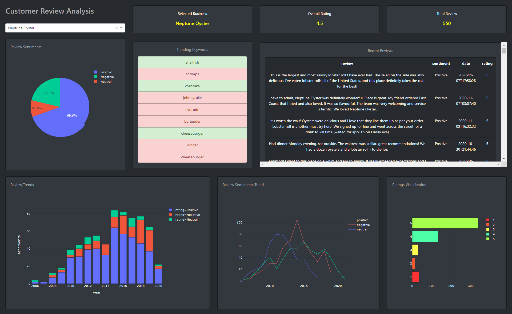

# Customer-Review-Analysis-SAAS
In an era of digital advancement and e-commence, almost each and every product and service has indirect and direct digital presence. Consumers of these product and services leave feedback on these over various mediums which create a solid long term momentum of the organization. Hence it is utmost important for business to interoperate the customer impression as early as possible and do the necessary course correction.

Customer Review Analysis is a prototype open source platform to turn the customer feedbacks in to visualization and extract the trending keywords. 

## Product SnapShot

## How to Reproduce - local
1. download dash.zip file
2. unzip
3. go to the directory
4. install the dependencies using: pip3 install -r requirments.text
5. run the application: python application.py

## How to Reproduce - AWS
1. download dash.zip file
2. follow the deploymeny guidance document

